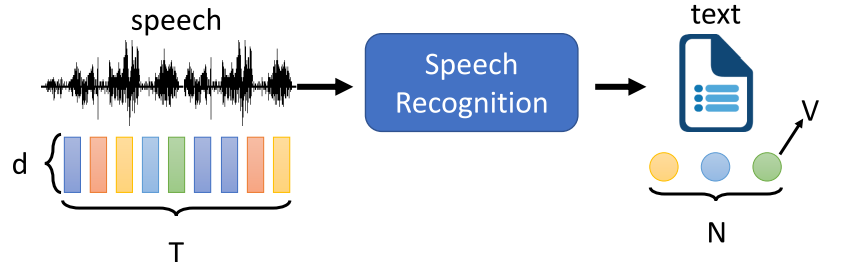
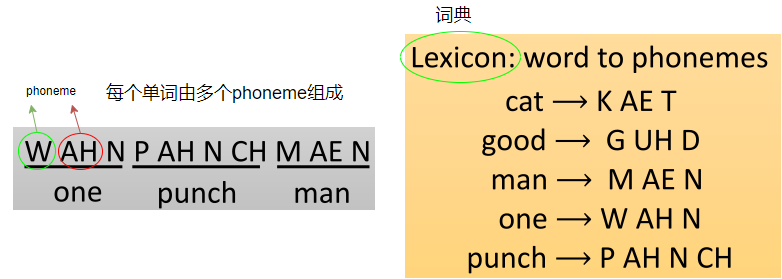
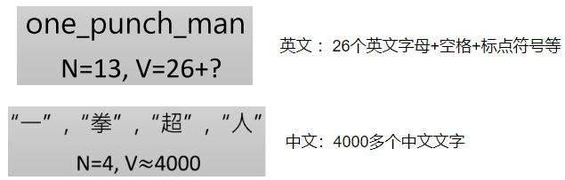
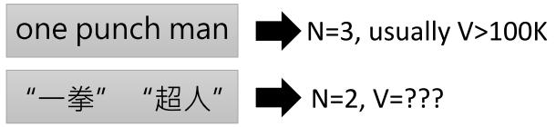
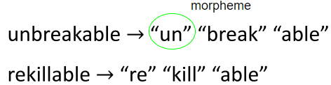
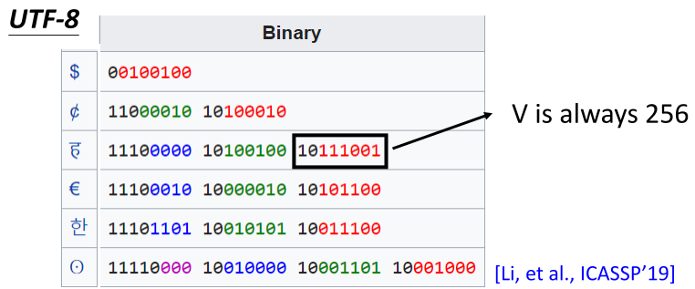
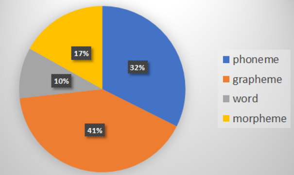
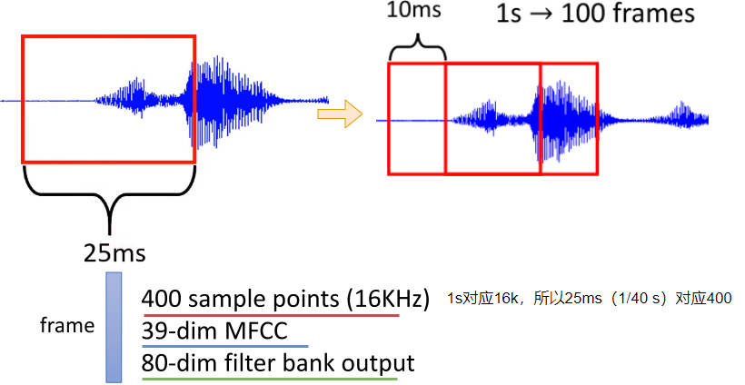
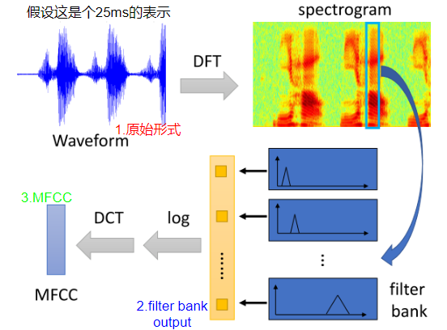
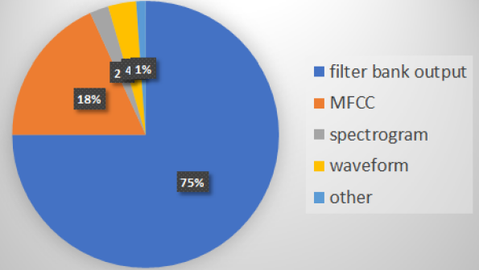

# 语音辨识（1）

> 这部分主要介绍：语音的表示和文本的表示

语音识别要做的事情：

> 识别语音，并转换为文字

对于语音识别系统，如何表示语音和文字：

- 语音（输入）：一连串的向量（比如T个d维向量）
- 文本（输出）：一连串的token（比如N个token，其中token空间可以包含V种形式的不同token—一般V远大于N）

> 此处的token可以暂时理解为向量

## 1. 文本的表示—Token

Token有非常多种不同的表示形式，下面介绍几种

#### ① Phoneme

> 发音的基本单位

即语音识别系统先将语音识别成一系列 phoneme，然后再利用"词典"，将其转换为对应的输出（预测阶段）

> 训练阶段，先将单词转换为对应的 phoneme

优点：phoneme和声音之间的关系非常密切（所以可能更容易学）

缺点：需要"词典"（lexicon），这往往需要语言学家建立

> 如果某个单词没有出现在词典里面，那就无法识别出来

####   ② Grapheme

> 书写的基本单位

优点：可以利用听到的内容拼凑出新的单词（比如英文字母凑出新的单词），以及无需"词典"

缺点：由于文字和声音之间的关系比较复杂，往往和上下文有关，因此有可能会拼错（可能拼出不是单词的单词）

#### ③ Word

> 很少用

优点：不会拼错

缺点：词的数目非常非常多，比如中文几乎无法穷举

#### ④ Morpheme

> 可以传达语义的最小单位（介于grapheme和word之间）

至于Morpheme如何获取（我们怎么知道某种语音的morpheme）：

1. 请语言学家帮忙
2. 利用统计的方式，比如收集一堆文本，统计某些"词根"之类的出现的频次

#### ⑤ Bytes

> 直接用二进制来表示

优点：各种语言都可以用UTF-8来表示，这就使得多语音成为可能

缺点：可能比较难学（毕竟和语音相关性没那么强）

### Token不同形式的受欢迎程度（19年三大顶会统计情况 ）

## 2. 语音的表示

左边是一个25ms的声音讯号，往往有三种不同的表示方式：

1. 原始的形态，对应一个400维的向量
2. MFCC形态：对应39维的向量
3. Filter bank output的形态：对应80维的向量

> 暂时先知道有这三种表示形态就好：
>
> 

假设总共有1s的声音讯号，按照每10ms的滑动窗距离，其对应有100个25ms所对应的向量

### 语音不同表示形态的受欢迎程度（19年三大顶会统计情况）

