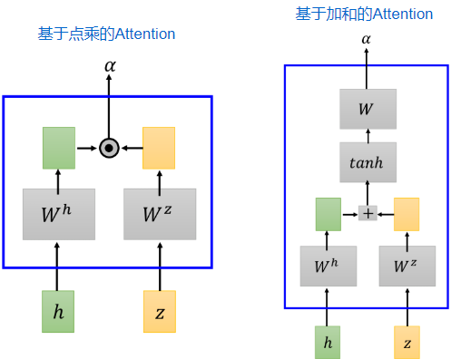

# 语音辨识（2）

> 这篇主要讲语音识别里面常用的模型

主要有下述几种常见的模型：

- LAS（Listen, Attend, and Spell）
- CTC（Connectionist Temporal Classification）
- RNN-T（RNN Transducer）
- Neural Transducer
- MoChA（Monotonic Chunkwise Attention）

## LAS

### Listen

首先来看Listen（其实就是一个Encoder）：

Listen的主要作用：

1. 抽取有用的信息（可以类别图像里面的高层语义特征）
2. 移除说话者的差异，消除一些噪声的干扰等

至于里面的Encoder：即可以采用RNN，也可以采用CNN，也可以结合Attention机制等等；至于输出也可以进行下采样（无需保持和输入等大小）等等

### Attend

> 可以理解为搭建起Listen和Spell之间的桥梁

Attend其实就是Attention机制（核心就是Decoder部分的输入$c^0$和高层语义$h^1\sim h^k$之间的关系—举例而言就是你的词和那些语音之间存在关联）：

其中的match函数，其实就有很多种不同的选择，比如基于点乘的Attention，基于加和的Attention方式

### Spell

> 注：Spell具体指的是右边部分，且是预测阶段；训练的时候始终采用ground truth作为$z^{next}$的输入（因为训练过程中输出的c前期很不准确）

### Beam Search

上述预测阶段利用argmax采用的是贪心算法，但贪心算法并不一定获取最好的结果，因此可以采用beam search的方法，具体原理如下所示：

> 针对上述例子，就是输出的时候在每种状态始终保留两种可能的输出

### 采用不同形式的Attention (即Attention的结果几时使用)

> 注：这里Attention省略了Encoder里面的h

但上述采用Attention都是和全部的Encoder产生的h进行weight，但实际上语音辨识里面：应该和顺序很有关系（因为一段语音前面的就应该对应前面的单词才对），而采用全部的似乎有点"太浪费了 "

因此有Location-aware attention：

### LAS存在的问题

期待语音辨识系统能够实时输出结果：即一边听声音，一边输出文字

- 但LAS需要将整个句子先听完（因为Attention需要用到整个句子）

## CTC

CTC其实就可以简单的理解为将Decoder替换为Classifier；

直接采用上述方式处理存在的问题就是输入的语音特征会大于输出的token数目，在CTC里的解决方案：

- 引入$\phi$，当没有token的时候就输出这个$\phi$
- 对最后的输出进行后处理：合并重复的字母，去掉$\phi$（比如下面的例子）

还存在一个问题：在训练的时候标签又该怎么产生呢？（比如输入是4个vector，而输出只有两个token，此时就需要插入$\phi$或者采用重复的方式，具体应该选用这么多不同形式中的哪种）：

- CTC里面采用穷举所有的可能都作为Ground Truth（具体如何穷举，之后再讲）

### CTC存在的问题

## RNN-T

