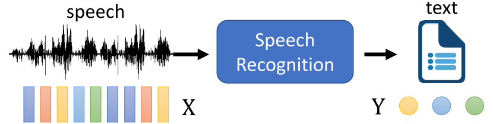
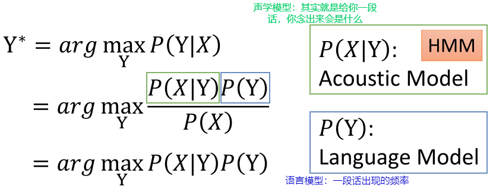
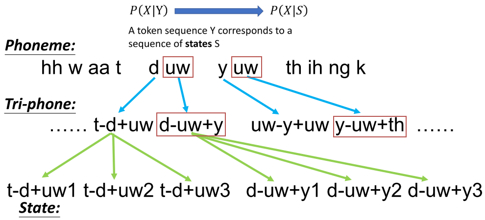
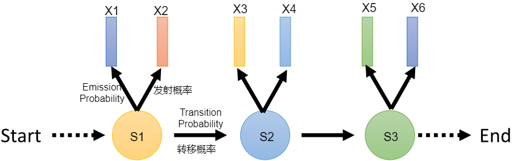
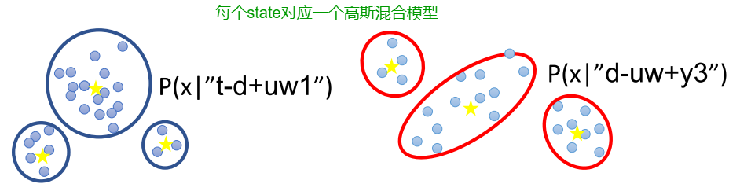
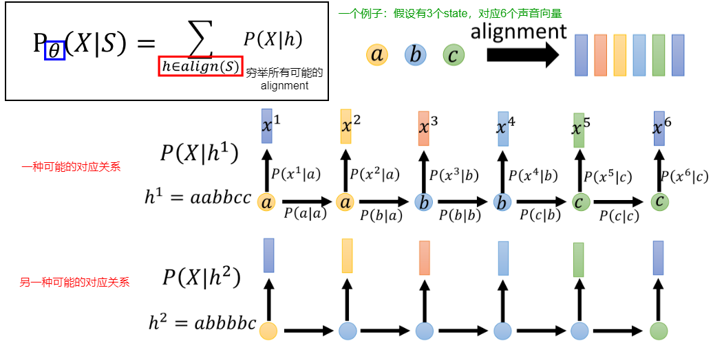
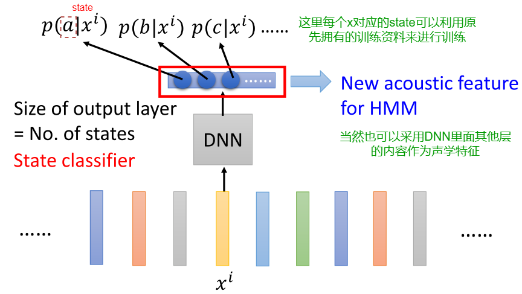
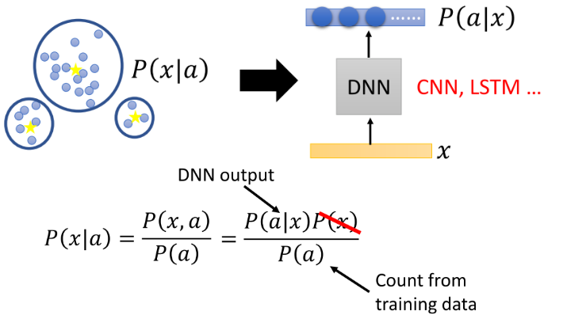

# 语音辨识（3）

> 这部分主要介绍HMM（Hidden Markov Model）方法

语音识别其实就相当于求解下述式子：

> 1. End-to-End的模型就是直接求解上述的$argmax_{Y}P(Y|X)$
> 2. 而$P(X)$：由于给定的一段语音是固定的，所以可以视为常数

现在先不管那么多，我们先来看采用HMM如何刻画声学模型，即$P(X|Y)$

## HMM

首先，在HMM里面，采用的是比token更小的单位state（至于为什么采用更小的单位，后续会解释）：

- 从phoneme到Tri-phone的主要目的是同一个phoneme受到前后语境的影响，因此采用Tri-phone；而state是Tri-phone进一步的细分，一个Tri-phone可以对应多个state（具体对应多少个根据你的资源来决定---比如上述的例子是3个）

下面就进一步来看，在HMM中，如何去刻画这个$P(X|S)$：给定一系列单词（此处采用state形式），得到某段声音的概率：

主要采用两个概率来刻画：

- 转移概率（Transition probability）：从当前state转移到下一个state的概率
- 发射概率（Emission probability）：当前state产生某段声音的概率

> 在HMM中，发射概率假设某一个固定的state，它发出来的声音满足一个固定的分布（这也是为什么采用state作为单位，因为单位不够小，往往就不满足这个假设了）
>
> 

每个state对应一个GMM会存在一个问题：就是导致GMM太多了；常用的方法就是将一些state共享同一个GMM。

下面假设我们已经学到了转移概率和发射概率（具体怎么求这里面没有涉及到），我们依旧无法直接求出$P(X|S)$，因为我们还不知道具体的对应关系（即alignment—输入的state往往少于输出的语音对应的vector），解决方法依旧是穷举所有的可能：

## Deep Learning+HMM

### ① Tandem

核心思想：就是利用DNN学一个更好的声学特征来取代原先的类似MFCC等声学特征（即将$P(X|S)$中的$X$替换掉，剩下的完完全全按照HMM进行即可）

### ② DNN-HMM Hybrid

将Gaussian Mixture Model用DNN来替换掉（注意如何从P(a|x)到P(x|a)）：

在DNN中，所有的state共用同一个DNN，这就非常类似于Subspace GMM；所以非常强！

由于我们并不知道：$x$和$P(a|x)$之间的对应关系（即不知道alignment），因此在真实的训练过程中采用下述方式：

1. 先用HMM（采用GMM）学完，然后就可以获得每个$x$和对应的$P(a|x)$，然后获得了alignment，再利用这个alignment的对应关系训练DNN；
2. 如果想继续玩下去：可以用训练好的DNN获取aligned的关系，再去训DNN，不断进行下去。

