# 语音辨识（5）

> 这部分主要介绍Language Model

Language Model就是用来估测某段token出现的几率（简言之：一段话出现的频率---因为有些单词基本不会一起出现）

我们为什么需要Language Model呢？

1. 在HMM里面，求解的式子如下所示：
   $$
   Y^\star=argmax_YP(X|Y)P(Y)
   $$
   因为里面就需要用到Language Model（$P(Y)$），所以是需要Language Model是很合理的
   
2. 而在基于Deep Learning的一些方法（比如LAS），其求解的是：
   $$
   Y^\star=argmax_YP(Y|X)
   $$
   似乎没有什么必要用到Language Model。

但是！基于Deep Learning的方法，将结果直接乘以Language Model（$P(Y)$）也是有效的！

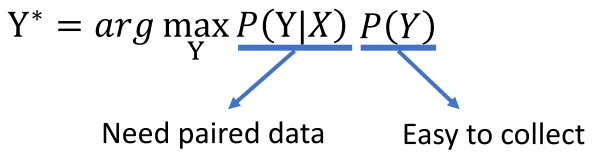

虽然数学上面似乎不太讲得通，但主要的原因就在于：

- 我们的$P(Y|X)$由于数据没有那么多 ，所以其实学的也没有那么好
- 而Language Model由于数据非常非常多，且有很多其他人训练好的好到爆炸的模型；所以组合起来就可以是的结果变好！（其实就是使得你输出的Y更加合理—不会出现那种基本不会出现的句子）
- 在更进一步：只要你的模型输出是文本形式，乘上Language Model这一项往往都是有效的！！！

## 如何估测一个token sequence的几率

>  其实就是如何学一个Language Model

最暴力的想法就是：收集大量句子，然后判断每个句子出现的几率，但是存在下述问题：

- 没有出现的句子就会被认为出现的几率是0，这是不合理的；你总不可能收集到全部的句子吧！！！

下述非常自然存在：N-gram  → Continuous LM → NN based LM

### N-gram方法

核心思想就是：估测N个连续单词出现的几率

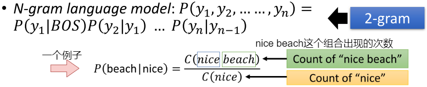

这种方式存在的问题：预估的概率其实不太准确

- 数据是比较稀疏的，很多n-gram依旧没有出现过（比如：The dog ran ...； The can jumped...都出现过，但是就是没有出现过The dog jumped或者The can ran这样的组合，那么根据n-gram的定义，$P(jumped|the,dog)=0,P(ran|the,cat)=0$）

为了解决上述问题，Language Model往往需要做平滑化处理（Language model smoothing）：即赋予那些没有出现过的较小的几率而非零，比如：

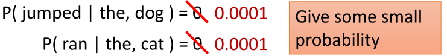

其中比较典型的Language model smoothing就是：Continuous LM

### Continuous LM

其核心思想就是Matrix Factorization：利用已知未知信息，对未知位置信息进行填充

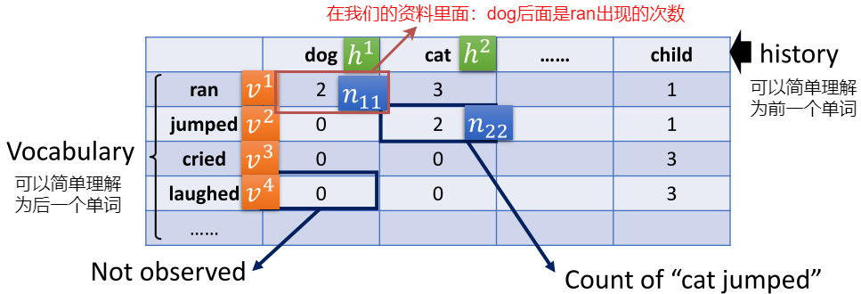

1. 非零部分：代表已知信息
2. 零部分：代表位置信息

那么我们假设$v^i$和$h^j$的乘积等于$n_{ij}$（至于$v^i$和$v^j$是什么，不用关心：其实代表这个词的属性，具体学出来就好），从而我们只需要对那些非零部分做minimizing即可：

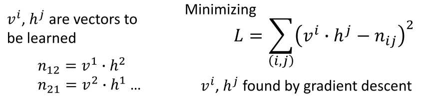

> 从而：如果dog和cat具有类似的$h^{dog}$和$h^{cat}$，如果$v^{jumped}\cdot h^{cat}$比较大，那么$v^{jumped}\cdot h^{dog}$也会比较大！！！！

所以这里的smoothing是学出来的！！！

将上述表达式用两层的NN来等价：

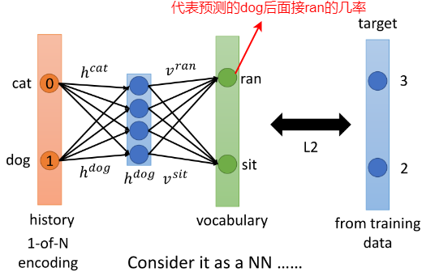

既然可以用两层来表示Continuous LM，那么为何不采用更深的网络！！！

### NN-based LM

#### ① N-Gram形式的NN-based LM

给定N个词汇，预测下一个词汇：

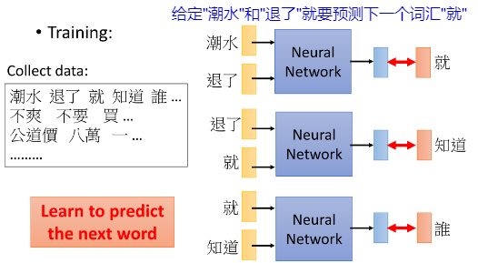

从而任何一个句子出现的几率就可以用NN-based的情况替换掉（之前N-gram计算几率的方式中的概率替换成NN预测的几率）--- 预测阶段：

#### ② RNN-based LM

 主要为了克服：看很长前面的信息才决定下一个单词出现是什么（即下一个单词和前面的信息都相关）

> 因为一般N-gram里面用单3-gram比较常见，太长的话内存和速度等限制

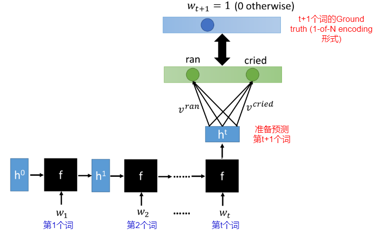

## 如何将LM和LAS等语音辨识系统结合起来

> 即如何采用LM来提升语音辨识系统

根据：

- 怎么结合：将两者的输出进行结合，还是中间的feauture部分进行结合
- 什么时候将LM加进来：将LAS训练完再和LM结合，还是LAS从头开始训（训的时候就受到 LM的影响）

分为下述几种方式：

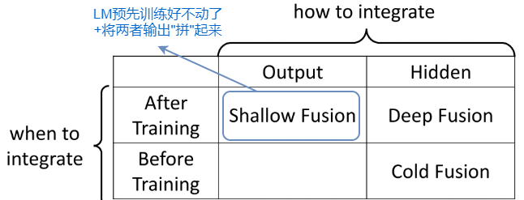

> 注意：不管哪种方式，LM的参数都不会发生更新哦！！！

### ① Shallow Fusion

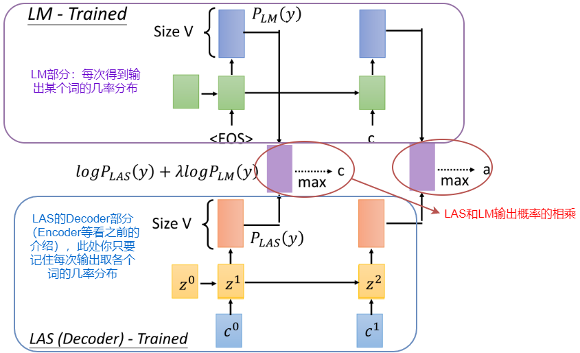

> 注：$log(P_AP_B)=logP_A+logP_B$

其核心就是：我们不止相信LAS的结果，还希望这个结果和LM的输出尽可能相同（因为相同，乘积最大）

### ② Deep Fusion

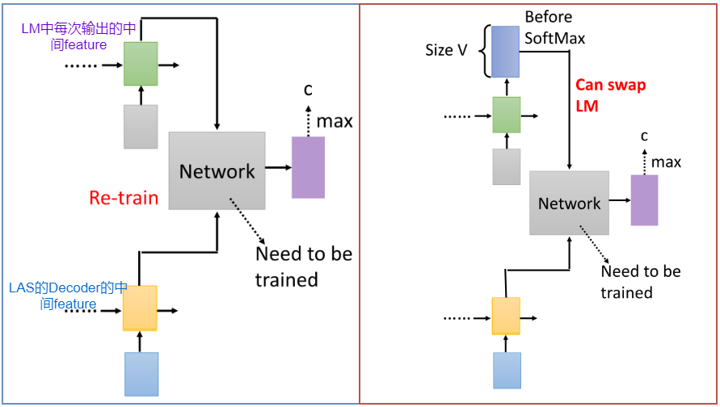

- 左边的形式：存在的问题就是Network（图中写的Network部分）依赖于LM中间的feature，而替换LM就会导致这个中间的feature发生了改变，因此需要重新训练Network部分
- 右边的形式：正是为了解决上述问题而产生的，因为理想情况下Before SoftMax的信息就已经代表了输出结果（大的那个值会占据主导，那么更换LM，只要两个LM都很强，依旧会使得 大的那个值占据主导：即经过softmax之后，基本上代表的是同一个东西）

### ③ Cold Fusion

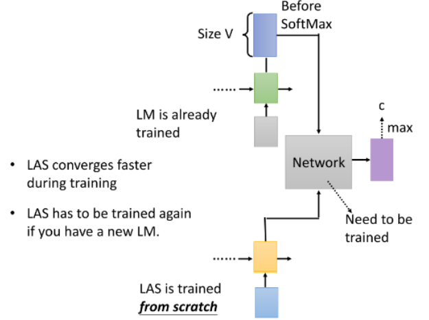

即LM参数固定，LAS从头开始训练

这么做的好处：

- 能够加快LAS训练的收敛速度（因为LM已经解决了词和词之间的关系 ，那么LAS训练的时候只需要专注于语音和文本之间的转换）
- 但同时也会带来一个问题：此时的LM就和LAS绑定起来了，不能够随便更换LM了

