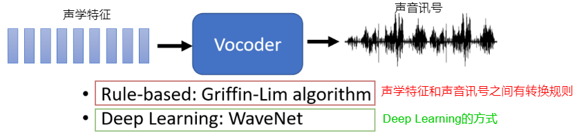
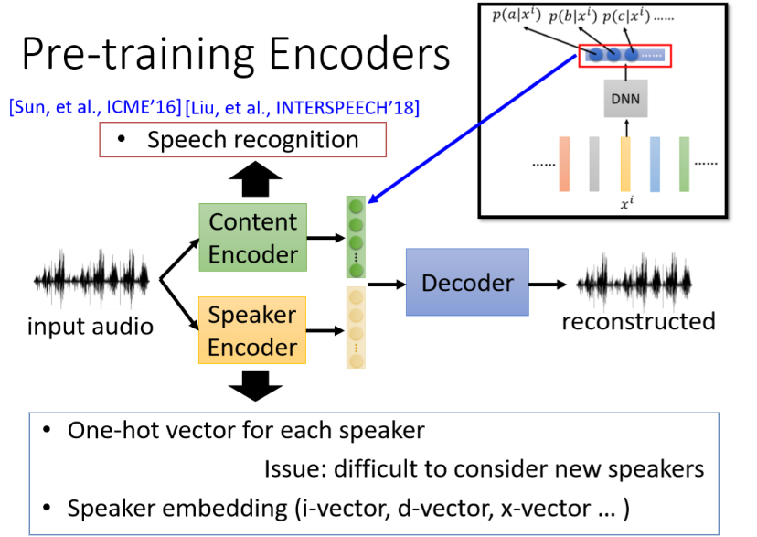

# 声音转换（1） 

> 这部分主要介绍Voice Conversion的基本概念

## 什么是声音转换 &  声音转换有什么用 

声音转换就是将一段声音转变为另一段声音，而这两段声音之间往往具备下述特点：

- 两段声音共性的东西：一般希望两者所表达的内容是一样的（即对应的文本内容是一致的）
- 两段声音不同的地方：根据不同的应用，不同的特性往往不同（比如两段声音之间的语气不同，两段声音来自不同的人讲的等等）

那么自然会想，这样的方式有什么用途呢？主要有下面这些用途：

#### ① 基于语者的声音转换

> 将一段话从一个人说的，转为另一个人说的

- 同一段话由不同人讲出来所带来的影响是不同的（比如老师的声音和你说你达到毕业要求了，和你的室友的声音和你说你达到毕业要求了，可能你更相信前者的吧。）
- 能够欺骗过一些声音识别系统（现在的银行等都会有基于声纹的匹配等，如果一个系统能够完美的转换欺骗过声音识别系统，就能进行"欺诈"）
- 保护语者隐私等
- ......

#### ② 基于说话风格的声音转换

> 将某种场景下的一段话，转为另一段场景下的一段话

- 将一段话从正常的语气转变为生气的语气
- 将一段悄悄话转变为正常语气的话语
- ......

#### ③ 提升声音的可理解性

> 将一段不那么易于理解的声音（比如非母语国家的人讲的话）转变成易于理解的声音

- 将发音障碍者讲的一段话转变成正常的一段话
- 将非母语国家的人讲的一段话转变为母语国家的人讲的一段话
- ......

#### ④ 做数据增广

> 增加训练数据

- 将男生的声音转变为女生的声音，这样就增加了一倍数据
- 对声音进行去噪
- ......

## 声音转换的具体实现

先来看下声音转换的输入输出再具体实现时往往怎么处理（或者称之为做了些什么限制）：

> 大多数文献上都是采用了 转换前后的声学特征具有相同的长度；但真实情况下，同一句话，不同语者讲出来其实声学特征往往长度是不相同的

但我们光有转换后的声学特征还不够，还要将声学特征转换回具体的声音。

> Vocoder是一个通用的方法：只要模型出来的是acoustic feature，都需要Vocoder将其转成声音讯号；

在这一章节中，我们都不考虑Vocoder部分，只考虑前面关于acoustic feature的转换

整个声音转换（Voice Conversion）根据训练集的数据可以划分为：

成对资料的特点：

- 训练方式简单：直接强行训练一波即可
- 存在的问题就是：成对的训练资料很难收集到
  - 采用Pre-training Model，即采用少量数据对已经训练好的seq-to-seq模型进行fine-tune
  - 采用语音合成的技术：比如你收集到了很多不同人说的不同话，然后你用类似Google小姐将这些句子全都念一遍，就有了成对的资料了（但是这种方式只是用作将其他人的话转换成google小姐说的话）

没有成对的资料（更常见的情况）：

- 其实类比Image style transfer，可以做audio style transfer

常用的Unparallel Data的处理方式有：

1. Feature Disentangle：声音讯号里面包含了多种不同的资讯（比如内容的资讯，语者的资讯，背景的资讯等等），然后将这些资讯分离出来，再将其在某种资讯给替换掉即可
2. Direct Tranformation：直接转换

### Feature Disentangle

> 这里主要考虑语者资讯进行替换，即对应将一个人说的话转换成另一个人说的话

- 整个方式其实和Auto-Encoder非常类似（Decoder一样，对Encoder部分进行拆解，分成好几个部分）
  
- 你可能会问那类似背景的资讯等等怎么没考虑呢？——其实这里的关键是语者信息的转变，那么不管背景的资讯是蕴含在Content Encoder形成的code里面，还是Speaker Encoder形成的code里面，对于任务本身是没有影响的，因此我们可以认为我们关注的只有内容和语者这两种资讯
- 你更可能会问：我们如何保证上面的Content Encoder出来的就是包含内容资讯，而下面Speaker Encoder出来的就是语者资讯呢？——这个就主要根据算法设计者的设计了，下面将一些过去用到的方法来解决这个问题

#### ① 利用语者信息

- 就不要什么Speaker Encoder了，就直接这部分输出一个one-hot来代表输入语者（训练的时候这句话是哪个语者说的是已知的）；寄希望于既然我们已经直接在训练的时候告知了语者的信息，那么希望Content Encoder就更倾向于去学到内容的信息，而少关注语者的信息（PS：这里在Decoder时的输入包含Content Encoder产生的code+这个one-hot）
- 虽然上述不能保证Content Encoder真的就不学习到语者的信息，但是去调整Content Encoder输出code的维度，其实最后实验出来的结果还是蛮不错的

上述方法存在的问题：

- 无法考虑新的语者（Speaker），因为在训练的时候one-hot只表示了之前有的Speaker

#### ② 采用Pre-training Encoder

针对Speaker Encoder，有很多训练好的模型输入是一段声音，输出代表语者说话的特征（网上有很多pre-trained的Speaker Encoder），比如下述几种：

针对Content Encoder，可以采用语音辨识模型（因为语音辨识系统输入是一段声音，输出是这段声音对应的文字），但是我们不能直接将文字作为code，因此常常采用输出的probability的信息作为content code

> 上述pre-training在我们的训练资料上再进行fine-tune就好了

#### ③ 对抗训练

 

- 希望Content Encoder产生的信息能够骗过Speaker Classifier，这样侧面就代表了这部分产生的code不包含语者的信息
- 你可能会好奇为什么对下面的Speaker Encoder不做什么约束呢？——其实是因为你想让Decoder的输出和输出尽可能相似，你就要想办法将Content Encoder产生的code所不具备的语者信息重新找回来！而这部分就在Speaker Encoder当中

#### ④ 设计网络架构

首先给出常用的整体架构方式：

解释：为什么Instance normalization能够移除语者的信息？

- 我们可以假设每个1-D卷积得到的是4个响应（图中的一行），那么类似内容相关的信息往往只包含在某一个响应中（因为比如：今天天气怎么样这么一段语音，不同部分包含的内容不一样）。而语者相关的往往会产生4个类似的响应
  - 内容相关：`100,0,0,0`，此时进行instance norm会得到`1.73,-0.57,-0.75,-0.57`
  - 语者相关：`50,50,50,50`，此时进行instance norm会得到`0, 0, 0, 0`

所以才有Instance Normalization能够有效提取出内容信息

解释：AdaIN具体在做什么事情？

- Decoder中也会对输入做Instance Normalization消除语者的信息，而利用Speaker Encoder产生的code对Normalization过后的内容进行scaling，从而使得语者信息恢复回来。（即放大差异！）

论文作者通过实验，确实有发现Instance Normalization能够有助于去除语者信息。

#### Feature Disentangle存在的问题

上述介绍的各个方法，在训练的时候都只是考虑将语者信息和内容信息分离开来，但始终没有考虑替换了语者信息之后合成的声音真的像语者B说的吗（质量是不是真的好——因为训练的时候从来没有考虑过两者的结合）：

> 训练的时候始终没有考虑过voice conversion

要如何克服这个障碍，使得合成的声音质量更好呢？采用2nd stage training，即训练的时候将voice conversion考虑进来

初步想法（那就让训练的时候有testing的情况）：

- 问题：A并没有讲过这句话啊，所以我们就没有这种形式的Ground truth

为了克服这个问题，加入GAN的思想（希望合成的声音讯号能够像人讲的声音）

除了更新Decoder的方式外，还可以不动Decoder，我们引入一个"补偿模块"（Patcher）来使得Decoder生成的句子像人讲的话：

> 上述称之为2nd stage training主要是指先按照之前的训练完，之后再加入这种方式来和testing阶段吻合

### Direct Transformation

> 直接进行转换

#### ① Cycle GAN

初代想法：

- 存在的问题：就会倾向于将X转换为Y语者的某句话（和当前输入完全无关的一句话），因为这样就能骗过D啊

加入约束：

双向版本：既有X转化为Y，也有Y转换为X

#### ② StarGAN

> 可以认为是CycleGAN的进阶版，主要为了克服CycleGAN在多人之间转换存在的问题

核心思想：希望G和D做的事情更多

- G和D的能力更强了，当你告诉我你希望输出是哪个语者，我就能根据这个提示"满足"你的要求

整个框架：CycleGAN vs StarGAN

