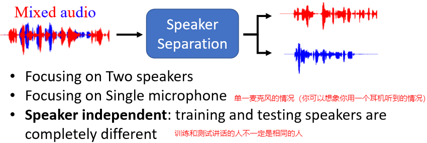

# Speech Separation (1)

> 可以翻译为语音分离？这部分主要介绍 基本 概念以及常用的一些方法

##  1. Speech Separation的概念

Speech Separation主要分为两种情况：

1. 如何将人的声音从背景噪音中抽离出来（Speech Enhancement）：其实就是声音去杂讯
   
2. 将多个说话者的声音分别抽离出来（Speaker Separation）：
   

==下面的内容主要专注在Speaker Separation，且主要关注Two  Speaker的Separation==：

一些注意事项：

- 这里的输入和输出都直接是声音（你就简单得将声音理解为可以用一个向量来表示）

- 输入和输出长度一致：这样就可以不用非得采用seq2seq的模型了（因为输入是输出的叠加啊，所以 肯定是一样长的），此外即使采用seq2seq，前期也会先学到输入和输出是等长的
  -  你可能会想上述红色和蓝色可能不一样长啊，屁股后面补上就好了（因为就认为他没在讲话）

如果要训练，必然需要训练资料，那么训练资料该怎么获取呢？：反过来就就好了，我们将两个人的话叠加就来不就产生了训练资料吗：

## 2. 客观衡量Speech Separation的好坏

### ① SNR

> Signal-to-noise ratio（SNR）

SNR的定义为：

- SNR越大，代表越好 （即$E$越小）

SNR存在的问题（假设声音是一个二维的向量）：

- 左边情况：理论上指标非常大才对，但此处E不小，导致SNR指标不高
- 右边情况：理论上X1和X2的指标类似才对，但此处E2比E1小，从而X2的SNR要更大
- 上述两种情况和我们的直观感受相违背

### ② SI-SDR

>  Scale invariant signal-to-distortion ratio（SI-SDR），有时候也被称为SI-SNR

SI-SDR的定义为：

这样的方式就能够有效克服SNR存在的两个问题：

- 左边情况：SISDR趋于无穷大
- 右边情况：声音放大不带来指标提升

其实在论文里面，更常用的指标为SI-SDR improvement：

- 主要为了避免原始的声音里面SI-SDR就非常高，这样分离后高并不能说明分离效果的好

### ③ 其他指标

- PESQ：Perceptual evaluation of speech quality
- STOI：Short-time objective intelligibility