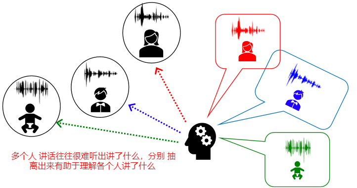
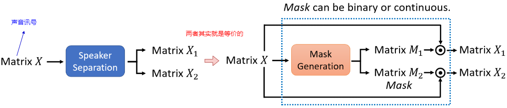
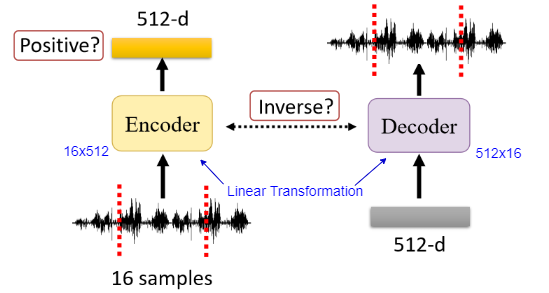

# Speech Separation (1)

> 可以翻译为语音分离？这部分主要介绍 基本 概念以及常用的一些方法

##  1. Speech Separation的概念

Speech Separation主要分为两种情况：

1. 如何将人的声音从背景噪音中抽离出来（Speech Enhancement）：其实就是声音去杂讯
   
2. 将多个说话者的声音分别抽离出来（Speaker Separation）：
   

==下面的内容主要专注在Speaker Separation，且主要关注Two  Speaker的Separation==：

一些注意事项：

- 这里的输入和输出都直接是声音（你就简单得将声音理解为可以用一个向量来表示）

- 输入和输出长度一致：这样就可以不用非得采用seq2seq的模型了（因为输入是输出的叠加啊，所以 肯定是一样长的），此外即使采用seq2seq，前期也会先学到输入和输出是等长的
  -  你可能会想上述红色和蓝色可能不一样长啊，屁股后面补上就好了（因为就认为他没在讲话）

如果要训练，必然需要训练资料，那么训练资料该怎么获取呢？：反过来就就好了，我们将两个人的话叠加就来不就产生了训练资料吗：

## 2. 客观衡量Speech Separation的好坏

### ① SNR

> Signal-to-noise ratio（SNR）

SNR的定义为：

- SNR越大，代表越好 （即$E$越小）

SNR存在的问题（假设声音是一个二维的向量）：

- 左边情况：理论上指标非常大才对，但此处E不小，导致SNR指标不高
- 右边情况：理论上X1和X2的指标类似才对，但此处E2比E1小，从而X2的SNR要更大
- 上述两种情况和我们的直观感受相违背

### ② SI-SDR

>  Scale invariant signal-to-distortion ratio（SI-SDR），有时候也被称为SI-SNR

SI-SDR的定义为：

这样的方式就能够有效克服SNR存在的两个问题：

- 左边情况：SISDR趋于无穷大
- 右边情况：声音放大不带来指标提升

其实在论文里面，更常用的指标为SI-SDR improvement：

- 主要为了避免原始的声音里面SI-SDR就非常高，这样分离后高并不能说明分离效果的好

### ③ 其他指标

- PESQ：Perceptual evaluation of speech quality
- STOI：Short-time objective intelligibility

## 3. 如何训练一个Speech Separation

首先先来看下训练的时候会遇到的一个问题：

为什么这个顺序会成为问题呢？假设有下述这种情况：

- 那么按照图中的Ground Truth的话，就会使得Network很难学（因为它不知道上面的分支应该学到男生的声音还是女生的声音——因为GT一会儿是男生的，一会儿是女生的。 你可以类别检测里面一个分支学分类，一个分支学检测，显然是各司其职）。直观的一些解决方法：
  - 那就强行让上面的为male，下面的为female：那么预测阶段碰到两个male的，估计就要凉凉
- 上述问题被称为Permutation Issue

> 虽然你可能会觉得不管三七二十一，随机将某个人的放到上面硬学一发；这样会到来的问题就是：你很可能输入同一段话—一句希望分出上面是A，下面是B；而另一句希望上面是B，下面是A

==下面的内容主要围绕如何解决这个问题来展开的==。

### ① Deep Clustering

在进入具体后续内容之前，我们其实可以将问题转换一下：输入的混合声音X其实就是两个声音X1和X2的叠加，那么speaker separation做的事情其实非常简单，产生两个掩码M1和M2（往往满足M1+M2=1）来拆分自己就好：

如何获取这个Mask（$M_1$和$M_2$）呢？其实可以采用Ideal Binary Mask来获取：

> 即利用原先声音的Ground Truth，利用谁的数值大就将谁的Mask置为1，另一个置为0；将这种方式获得的Mask作为Mask的Ground Truth

那么现在的问题在于学一个Mask Generation，而对应的Ground Truth就是左图的方式获得的Ideal Binary Mask

> 注：上面的Mask其实依旧还是存在谁先谁后的问题

下面就具体介绍Deep Cluster是如何做的

① 先来看Inference阶段：

- 这里有个很有趣的点哦：K-means其实产生的聚类结果哪个是第一类，哪个是第二类其实是随机的，所以产生的Mask谁先谁后其实是都有可能的哦！：但这并不妨碍Speech Separation这一过程。

② 下面来看Training阶段

由于K-means不可微分，所以训练采用的方式其实和k-means是无关的：

- 只要这里能够学到同一个人的特质相似，就会在聚类的时候聚到同一类

总结：

1. Deep Clustering其实效果是蛮好的
2. Deep Clustering存在的问题就是：训练不是end-to-end的——一方面由于k-means的存在，另一方面由于利用了Ideal Binary Mask（毕竟Ideal Binary Mask也是一种近似）

### ② Permutation Invariant  Training（PIT）

这个方法的核心思想就是：哪种排序的损失更低，就采用哪种排序

- 但这里的问题就是，我们只有一个比较好的模型得到的loss高低才具有比较好的借鉴意义

作者的解决方法：不管，就随着训练过程的进行，这种分配会越来越合理：

- 可以看到前面20个epoch，先后顺序发生改变的数量还是比较大的，但是到了40个epoch之后基本就不出现改变了。（因为一个epoch扫过了所有的数据，所以可以统计有多少比例发生了顺序变换）

### ③ TasNet (Time-domain Audio Separation Network)

- 这篇主要在输入输出上没有采用Spectrogram等
- 以及网络结构更深
- 训练的时候也采用了PIT的方式 

下面先来看下Encoder和Decoder：

- Encoder和Decoder部分就是简单的Linear  Transformation
- 关于是否对Encoder的输出做ReLU（全都转为正数）：实验情况是没有必要
- 关于是否要保证Encoder和Decoder之间满足Inverse的关系 ：实验情况是保持Inverse反而影响实验结果
- 在实际情况：是输入一串的声音，然后产生N个512-d的向量

下面是Separator模块：

- 输入可以看出是`Nx1x512`，然后经过一系列卷积之后变成`Nx2x512`，对应两个Mask
- 其中的Sigmoid以及sum  to 1都是可以去掉的

论文中真实采用的Separator则是一个非常深的网络，如下图所示：

- 相当于听过了1.53秒的声音，才产生此mask

### ④ 其他

下面给出各个论文里面一些性能结果：

- 但并不是说该结果好，就一定泛化性能好；在很多情况下，Deep Clustering反而效果更好

## 4.  更多内容

关于Speech Separation还有很多可以探索的内容。

### ① Unknown number of speakers

> 当不知道有几个人声音混合的时候，怎么分离这些人的声音

- 每次只分离一个人出来
- 还关联到多少次迭代之后该停止（即几时只有两个人了）

> [Recursive speech separation for unknown number of speakers](https://arxiv.org/pdf/1904.03065.pdf)

###  ② Multiple Microphones

> 超过一个麦克风的情况

- 输入多个麦克风的声音讯号，输入对应希望的Ground Truth，强行学就好了。

> [FaSNet: Low-latency Adaptive Beamforming for Multi-microphone Audio Processing](https://arxiv.org/abs/1909.13387)

### ③  Visual Information

> 用影像（图像或者视频）的资讯来增强Speech Separation

比如圈出A的人头，就分离A的声音；圈出B的头像，分理B的声音；如果两者都圈出来，则输出两者声音的混合。（具体怎么实现见：[Looking to Listen at the Cocktail Party: A Speaker-Independent Audio-Visual Model for Speech Separation](https://arxiv.org/abs/1804.03619)）

### ④ 任务导向

> 我们做这个分离的目标可能不同：比如让人听得更清楚，或者让某个机器接收（看是否接收正确）；不同的情况的优化目标其实是不同的

- 人在意的是可理解性
- 机器在意的可能和人不同（比如语音分离后面接一个语音辨识，而语音辨识可能关注某些人不同敏感的内容）

从而导致采用的优化目标函数不同