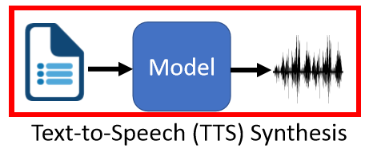
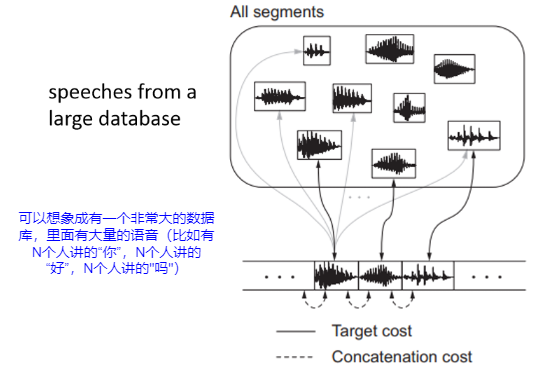

# 语音合成（1）

> 主要给你一段文字，你将它念出来（不仅要念出来，还要念的像人）：
>
> 

## 1. TTS before End-to-end

> 这部分主要介绍在深度学习之前语音合成是怎么做的

过去最常用的是concatenative approach：

- 可以将数据库看出一个字典，输入的单词就是key，然后找到对应的语音就是value，只是一个key可以对应多个value（因为同一个词可以有很多不同人讲），然后组合起来就好了
- 这里的一个关键就是如何将组合起来的语音尽可能逼真（即尽可能像是一个人讲的），就是所谓的concatenation cost

这种方法存在的问题：

- 如果想要合成某个不在数据库里的人物的声音，那就没办法了
- 数据库往往非常大，在离线环境下面就比较占存储

> 还稍微介绍了Parametric Approach的方法

## 2. Tacotron: End-to-end TTS

> 这部分主要介绍Tacotron这个方法，这个方法属于End-to-end进行训练的方法

Tacotron：

- 输入：character（字母）
- 输出：（linear）spectrogram（离真正的语音wave form非常接近了，你可以理解为差了一个linear transform，可以利用非DL的方法就可以进行转化）

在Tacotron之前也有很多尝试进行end-to-end的方式：

> [First Step Towards End-to-end Parametric TTS Synthesis: Generating Spectral Parameters with Neural Attention](https://pdfs.semanticscholar.org/64e3/16c8125742e02e7b8bb5094af3c17b96735e.pdf)
>
> - 输入：phoneme（具体是什么可以看speech recognition部分）
> - 输出：acoustic features（需要经过一个vocoder转换成声音）
>
> [Char2Wav: End-to-End Speech Synthesis](https://openreview.net/forum?id=B1VWyySKx)
>
> - 输入：character（字母）
> - 输出：acoustic features（需要经过一个vocoder转换成声音）

下面具体介绍Tacotron：其本质就是seq-to-seq+attention

