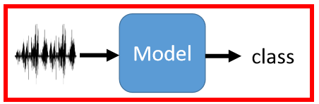
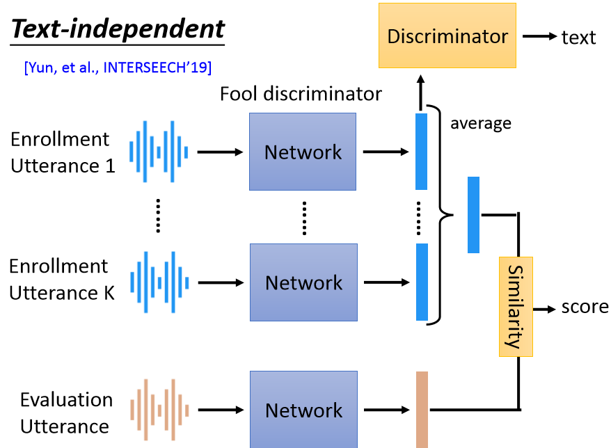

# Speaker Verification

> 这部分主要介绍输入一段话，辨别出是不是同一个人讲的：
>
> 

这种输入一段语音，输出分类有非常多的应用，比如：

但这一部分主要关注在==语者验证（speaker verification）==上面。

## ① 与语者验证类似的问题

语者辨别（speaker recognition / speaker identification）

- 输入一段语音，判别是谁说的

语者验证（speaker verification）

- 判断两段语音是否为同一个人所说

语者分段标记（speaker diarization）

- 在一段语音中，判断谁在何时说话

> 语者数目是否已知也可以划分为两种问题：
>
> - 语者数目已知：那就是将分割后的每段话进行分类（比如客服系统，判断一句话是客服讲的还是客户讲的）
> - 语者数目未知：那就是利用聚类的方式，来对相似的语音聚在一起

## ② 语者验证的评价指标

- EER就是图中FFR=FN地方的值

## ③ Speaker Embedding

> Speaker Embedding其实就是讲语者的一段话映射成语者特征（和图像等里面的语义特征比较类似）

通常一个语者验证系统包含三个步骤：

- 阶段1（Development，可以理解为部署阶段）：通过一系列的训练集先训练一个映射关系，能够将一段话映射到特征空间
- 阶段2（Enrollment）：如果一个语者需要开启语者验证功能，需要先采集几句话，将其产生的Speaker Embedding记录下来，作为模板
- 阶段3（Evaluation）：之后该语者进行验证的时候，通过对比说话者的话映射成的speaker embedding与底库里的模板是否相似。相似度超过某个阈值就代表这是某个人说的话

> 因此：最核心的其实就是如何学到一个好的映射关系，即如何获取一个好的Speaker Embedding

下面介绍一些如何从输入语音到Speaker Embedding的方法：

#### 1. i-vector

> 非deep learning的方法，其中的i代表identity

其中不管输入的speech多长，输出都是400维的特征

> 具体原理之类的没有读过，之后有时间读了再补充

#### 2. d-vector

训练阶段：

测试阶段：

- 由于在测试的时候是一长段话，所以采用各个片段对应speaker embedding的平均

#### 3. x-vector

- x-vector和d-vector最大的不同在于训练的时候x-vector将整段句子进行考虑，而d-vector则是按照每个句子片段进行训练。
- 如上图所示：训练的时候先将每个片段获取一个映射，再获得这些映射的统计特性，在进一步输入另一个网络，去获取x-vector

#### 4. others

还有更多花里胡哨的做法：

- [Attention Mechanism](https://arxiv.org/abs/1710.10470)
- [NetVLAD](https://arxiv.org/abs/1902.10107)

## ④ End-to-End

> 原先的方式：Speaker Embedding和Speaker Embedding的相似度分开
>
> 这里的目的：将Speaker Embedding和计算相似度一起学！

第一步：获取和Evaluation相类似的训练数据（即假设我们这边进行Enrolling的时候需要K段话）

第二步：训练目标—正样本score尽可能大，负样本score尽可能小

根据Enrolling的时候是否需要将指定的几句话，将任务分为text-dependent和text-independent，其中在text-independent往往会加一个Discriminator：

- 其实就是GAN的思想：希望产生的speaker embedding尽可能和这段文字无关